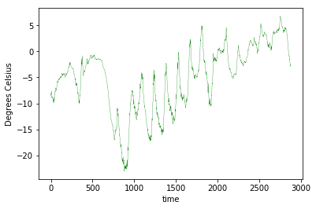
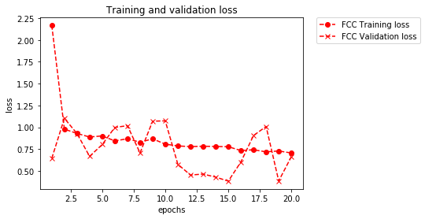
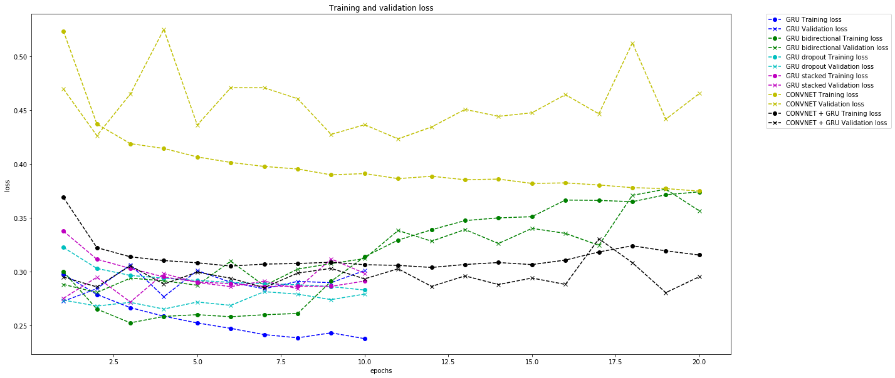
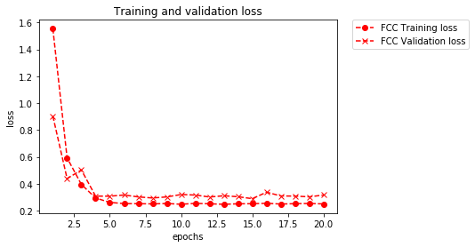
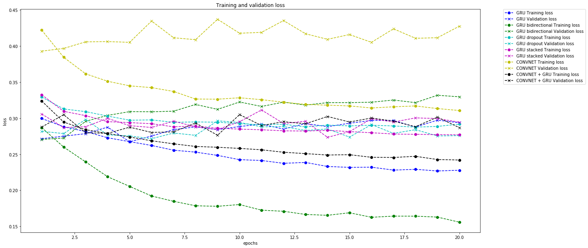

# Analysis report

## Introduction

In the following we seek to apply a simple fully connected network, a convnet and different recurrent neural networks to analyze a weather timeseries dataset (the so-called "Jena climate dataset") and predict the air temperature `24` hours in the future. An excerpt of the time series is depicted in the subsequent plot:

<p align="center">
  
</p>

Generally speaking, the goal of our analysis is to feed the networks with the training set and predict the future course for some timesteps.

The underlying insight to use deep neural networks for such a task (essentially a fitting-to-data problem) is that they are very powerful [function approximators](https://en.wikipedia.org/wiki/Universal_approximation_theorem). In this task we want to compare the performance on timeseries prediction of a [fully connected](https://www.deeplearningbook.org/contents/mlp.html), a [convolutional](https://www.deeplearningbook.org/contents/convnets.html) and a [recurrent](https://www.deeplearningbook.org/contents/rnn.html) neural network. 

The basic difference in between a fully connected and a convolutional layer is that the former learns global patterns in their input feature space while the latter learns local patterns. Importantly, these patterns are translation invariant and once a specific pattern is learnt in some part of data it can be recognized in another part. In this way, convnets need less training examples as they have a greater generalization power. In addition, convnets can learn more and more complex concepts while going deeper into the network. Hence, they can recognize statistical hierarchies of patterns. `1d` CONVNETs together with recurrent neural networks correspond to the two fundamental deep-learning algorithms available for processing sequential data (document and timeseries classification/comparison, sequence-to-sequence learning, sentiment analysis and timeseries forecasting). In particular, we will use simple recurrent NNs for our present timeseries regression problem. As opposed to dense NNs and CONVNETs, recurrent NNs do have a memory which allows them to better process sequential information. More precisely, these networks iterate through the elements of a sequence and while doing so keep information relative to what has been processed up to then. (In other words, a recurrent NN corresponds to a for loop which recycles information which has been computed during the foregoing iteration step of the loop.) Keras can implement different types of recurrent NNs and we will focus here on using the so-called GRU (gated recurrent unit) architecture. A detailed discussion of their setup, is found [here](https://www.deeplearningbook.org/contents/rnn.html).


### Network architectures (aspects of the learning algorithm)

We first use a simple dense model before employing more complicated RNNs.
Flattening is employed which is typical for such networks. One may say that
this removes the sequence aspect of the data and is to be contrasted to 
canonical sequence models (GRU, LSTM) where flattening is absent to respect
the ordering of the data in time. Notice the number of trainable parameters which is to be compared with those of the subsequent networks.

#### Dense network architecture:
```
_________________________________________________________________
Layer (type)                 Output Shape              Param #   
=================================================================
flatten_1 (Flatten)          (None, 3360)              0         
_________________________________________________________________
dense_1 (Dense)              (None, 32)                107552    
_________________________________________________________________
dense_2 (Dense)              (None, 1)                 33        
=================================================================
Total params: 107,585
Trainable params: 107,585
Non-trainable params: 0
```

We set up a recurrent NN a la GRU first. Observe that there is no "keras.layers.Flatten(input_shape..." present. The input_shape argument follows in the GRU layer. The Flatten-method would remove the sequential aspect (causality and order) of the data but this is exactly what we want to analyze using the recurrent model.

#### GRU network:
```
_________________________________________________________________
Layer (type)                 Output Shape              Param #   
=================================================================
gru_3 (GRU)                  (None, 32)                4512      
_________________________________________________________________
dense_5 (Dense)              (None, 1)                 33        
=================================================================
Total params: 4,545
Trainable params: 4,545
Non-trainable params: 0
```

Next, we set up a bidirectional GRU with one layer. For a problem such as temperature prediction, information coming
from the reversed direction cannot have a major impact as the temperature is effected by the recent past as we know. So we do not
expect much gains from such an architecture here. The bidirectionality is introduced via "model.add(keras.layers.Bidirectional(keras.layers.GRU(32),..." where the first GRU is argument to the Bidirectional section.

#### GRU network (bidirectional):

```
_________________________________________________________________
Layer (type)                 Output Shape              Param #   
=================================================================
bidirectional_1 (Bidirection (None, 64)                9024      
_________________________________________________________________
dense_4 (Dense)              (None, 1)                 65        
=================================================================
Total params: 9,089
Trainable params: 9,089
Non-trainable params: 0
```

Next, we set up a recurrent NN a la GRU with dropout to counter the overfitting problem. Notice that dropout regularization for recurrent models applies the dropout mask at every timestep in the same way. This is to be contrasted to the procedure for densely connected models (dropout at random). To this aim, we need to include dropout and recurrent_dropout in the GRU layer argument. (Actually, we would need more epochs due to dropout to get a converging model. We abstain from this here.)

#### GRU network with dropout:

```
_________________________________________________________________
Layer (type)                 Output Shape              Param #   
=================================================================
gru_4 (GRU)                  (None, 32)                4512      
_________________________________________________________________
dense_6 (Dense)              (None, 1)                 33        
=================================================================
Total params: 4,545
Trainable params: 4,545
Non-trainable params: 0
```

Next, we set up a stacked recurrent NN a la GRU with dropout and two layers. This should be good a) against overfitting b) reach good scores/overcoming a potential performance bottleneck as compared to networks of lower capacity. 

Again, we would have to train on more epochs (to counter the dropout) but abstain from this here.  Overfitting can again become a problem if we inflate the network architecture (layers and their units) to greedily. Notice that intermediate layers have "return_sequences = True" in the argument for which we refer to the Jupyter notebook.

#### Stacked GRU network with dropout:

```
_________________________________________________________________
Layer (type)                 Output Shape              Param #   
=================================================================
gru_5 (GRU)                  (None, None, 32)          4512      
_________________________________________________________________
gru_6 (GRU)                  (None, 64)                18624     
_________________________________________________________________
dense_7 (Dense)              (None, 1)                 65        
=================================================================
Total params: 23,201
Trainable params: 23,201
Non-trainable params: 0
```

CONVNETs are able to extract features from local input patches, allow for representational modularity and are data efficient. In fact, `1d` CONVNETs can compete with recurrent NNs on some sequence-processing tasks and are less costy. Indeed, `1d` convolutions are able to extract local `1d` patches, i.e. subsequences, from the entire sequence and thus are able to recognize local patterns in a sequence. Such a pattern can then be recognized at a different position due to the translation invariance of the convolution operation. However, since input patches are independently processed, CONVNETs are not sensitive towards time-ording beyond a local scale. This is demonstrated using the network below.

#### CONVNET:

```
_________________________________________________________________
Layer (type)                 Output Shape              Param #   
=================================================================
conv1d_1 (Conv1D)            (None, None, 32)          2272      
_________________________________________________________________
max_pooling1d_1 (MaxPooling1 (None, None, 32)          0         
_________________________________________________________________
conv1d_2 (Conv1D)            (None, None, 32)          5152      
_________________________________________________________________
max_pooling1d_2 (MaxPooling1 (None, None, 32)          0         
_________________________________________________________________
conv1d_3 (Conv1D)            (None, None, 32)          5152      
_________________________________________________________________
global_max_pooling1d_1 (Glob (None, 32)                0         
_________________________________________________________________
dense_1 (Dense)              (None, 1)                 33        
=================================================================
Total params: 12,609
Trainable params: 12,609
Non-trainable params: 0
```

Last, we try a combination of a simple CONVNET together with a subsequent recurrent NN. The idea is to obtain an operation corresponding to a downsampling of the data to shorter high-level featured subsequences which are then fed into the recurrent NN.

#### CONVNET and GRU network:

```
_________________________________________________________________
Layer (type)                 Output Shape              Param #   
=================================================================
conv1d_4 (Conv1D)            (None, None, 32)          2272      
_________________________________________________________________
max_pooling1d_3 (MaxPooling1 (None, None, 32)          0         
_________________________________________________________________
conv1d_5 (Conv1D)            (None, None, 32)          5152      
_________________________________________________________________
gru_1 (GRU)                  (None, 32)                6240      
_________________________________________________________________
dense_2 (Dense)              (None, 1)                 33        
=================================================================
Total params: 13,697
Trainable params: 13,697
Non-trainable params: 0
```

## Observation and results

First run:

We used as an optimizer "keras.optimizers.RMSprop" with a learning rate of `0.01`.

<p align="center">
  
</p>

<p align="center">
  
</p>

We observe that the dense network provides a baseline containing a lot of important information the performance of which is rather hard to beat for the other networks. It visualizes that it is hard to find a model which allows to go from the data to the targets. The first recurrent NN performs quite well already. It is superior since it is able to capture the sequential aspect of the data as compared to the dense model. 

One also observes from the plots of the training and validation losses that the models are overfitting unless they are enhanced using the dropout- and L2-regularization technique (the latter of which will be employed in a second run below). Weight regularization forces the weights to smaller values rendering the distribution of weights more regular. (Notice that since this penalty is only added at training time, the loss of the networks will then be higher as compared to test time.) On the other hand, dropout, when applied to a layer, randomly shuts down a number of units of that layer during training time. (At test time, the output of that layer is scaled down by the dropout rate.) In this way, insignificant happenstance patterns that the networks would learn to identify are broken up. We observe that the models amended by dropout are much less prone to overfitting as compared to the bare models. (Notice that dropout is differently imposed for recurrent NNs and dense NNs. We slightly touch onto this point above when discussing the network architectures.) 

One then observes that the simple recurrent NN with dropout approaches a performance bottleneck which indicates that the network capacity should be increased. The stacked model does exatly this and we observe improved results. (Adding additional layers will most likely become costy and is thus questionable.)

Regarding the model which employs the bidirectional RNN: Such models are typically used in natural-language processing. RNNs are sensible towards the ordering of the data and processing of the latter in both directions could be expected to observe patterns which would otherwise remain unnoticed. Importantly, as we notice also from the plots, analyzing timeseries data chronologically, outperforms a reversed-order analysis. This is different in natural language processing where it is clear that understanding a sentence does not strongly depend on the exact position of words.

As is well-known, CONVNETs are able to recognize local patterns in image data and recognize them elsewhere at a different postion due to the translation invariance of the convolution operation. From the weak performance of the simple CONVNET on the timeseries data, we understand that local input patches (subsequences of the series) are independently processed thus missing the time-ording aspect of the data beyond a local scale. However, the network is very speedy at performing the task. The combination of a simple CONVNET together with a subsequent recurrent NN combines the best of two worlds: The CONVNET serves as a speedy preprocessor to the order-sensitive recurrent NN. (Such a procedure is very useful when one is working with very long sequences which are downsampled to shorter high-level featured subsequences.) The performance of this model leads to quite acceptable results.


##### Further observations of the first run:

From the first run, we see that the models GRU, GRU dropout, GRU stacked do not yield processable data after epoch `10`. In fact, we see

```
Epoch 11/20
500/500 [==============================] - 238s 476ms/step - loss: nan - val_loss: nan
```

which indicates an exploding gradients problem most likely causeing of the nans. (Other reasons could be 1. nan-input data, 2. wrongly implemented loss function or 3. a numerical instability in the deep learning framework. From tests we can exclude these three.) Usual practice to counter this issue then is to decrease the learning rate. (Adding merely L2-regularization via "kernel_regularizer=regularizers.l2(0.001)" does not lead to a significant improvement. Also employing gradient clipping via "clipnorm=1.0" does not help on its own.) This led us to perform a second run, where we employ all of them and set the learning rate to `0.005`. In addition, we used a different optimizer: "keras.optimizers.Adam".

Second run: 

<p align="center">
  
</p>

<p align="center">
  
</p>

We see from these plots that the strongly regularized models perform much better. In addition, the nan-problem was indeed resolved by our strategy. 


### Improvements

One could perform an extensive survey to optimize hyperparameters of the models. Also, instead of the GRU layers, LSTM (long short-term memory) layers could be used. (These are generally more expensive to run since they have bigger representational power.) Bigger densely connected regressors at end of the recurrent NNs could also be employed to increase their representational power. Notice that at the end of such experiments the best models should be run on the test set which we have not done here.
